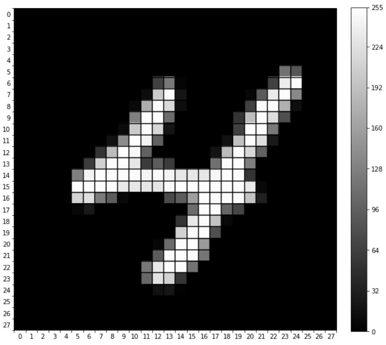
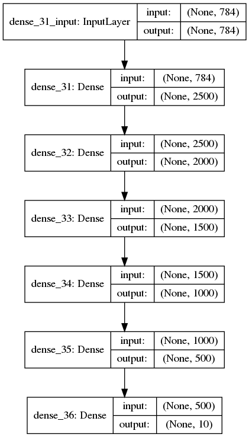
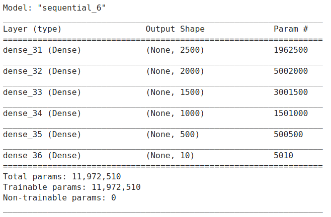
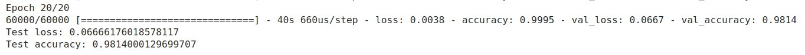
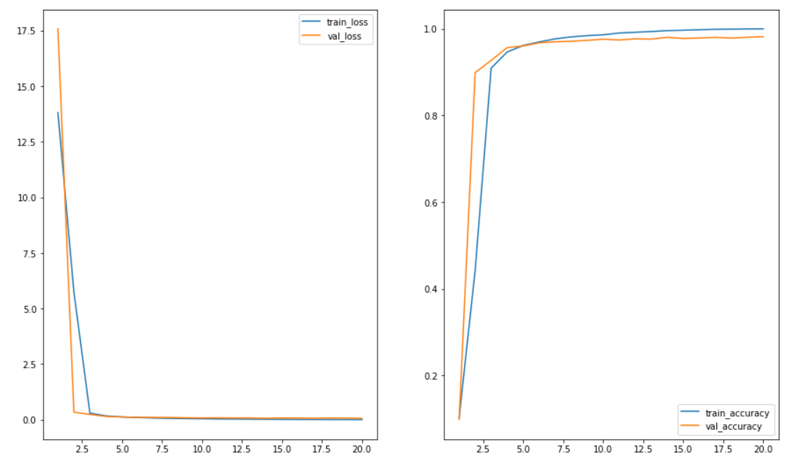

# MNIST

Solving the MNIST classification problem using a simple dense MLP. For this project I was inspired by this [paper](https://arxiv.org/pdf/1003.0358.pdf) by Ciresan el al.

## Data

The dataset is well known to the community. It's composed of data gathered with collaboration with NIST representing hand-written digits from 0 to 9. Each sample is a 28x28 image as shown below, however for this implementation I flattened the dataset to become a 1 dimension shaped sample.

## Model

The model trained was a MLP with 'tanh' activation and 'glorot_normal' initialization for the weights, optmizing categorical_crossentropy with SGD. 

Model Plot             |  Model Summary
:-------------------------:|:-------------------------:
  |  

## Training and Evaluation

After training for 20 epochs I was able to achieve a .9814 accuracy on the test set (10000 samples).

 
## Next steps

1. Experiment with other activations
2. Solve the same problem with a ConvNet